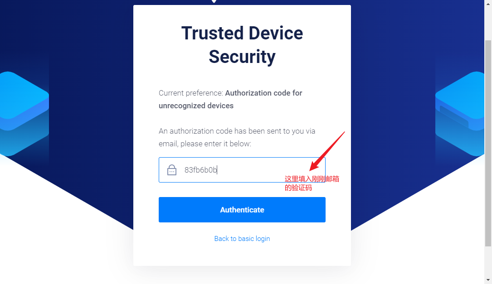

# 喂饭式VPS搭建部署网络加速服务器可访问Google/ChatGPT/MJ教程（亲测可用）
纯小白新手，想体验 GPT 和 MJ，看了VPS搭建 SS 教程发现都有坑没法搭建成功，写个文档记录可用无坑版。


成功图附上：


### 广告时刻
有老板觉得麻烦的，可以找我，我帮你搭建，。

### 自建 ss 服务器
搭建 SS 服务器主要为三步：
* 购买 `VPS` 服务器，推荐使用`Vultr`
* 部署 SS
* 使用 SS

### 一、购买 `VPS` 服务器
注册 [Vultr](https://www.vultr.com/?ref=9641324-9J)，从 [点我去注册Vultr](https://www.vultr.com/?ref=9641324-9J) 这个链接进入，第一次充值 10$ 可得 300$ 。

首先注册账号，输入可用的邮箱，然后点击 `Create Account`，如下：


点击 `Create Account` 后你的邮箱会收到一个验证码，如下：


把验证码复制，填到下方，点击 `Authenticate` 按钮：


之后可能要你同意协议，同意即可：


同意协议之后，进入到 vultr 主界面，如下，我们点击 `Skip Tour` 按钮：


不用填任何信息，关掉弹出的对话框，点击 `Account`：


点击 `Make a Payment` 按钮：


选择 `Alipy`：


随便填入一个姓名，地址这里点击 `Enter Manually` 按钮，如下：


修改账单地址为 `China`，地址信息随便填填，然后点击 `Save this address` 按钮，如下：


选择最小充值额 `10$`，同意用户政策，点击 `Pay with Alipay` 按钮，会调整到支付宝界面：


支付成功会自动回到 vultr 主界面，此时我们来确认一下是否有充值成功，点击 `Account`, 然后点击 `Make a Payment`，此时可以看到右上角确实是到账 `$310`


充值成功，开始霍霍，点击左上角 `Products`，然后点击 `Deploy Server` :


`Choose Type` 这里选择第二个，Shared CPU，如下：


`Choose Location` 这里选择服务器地址，这里我选了个美国的服务器地址，如下：


`Choose Image` 这里选择 `CentOS`，如下：


`Choose Plan` 这里点击 `Regular Cloud Compute`（穷人选项），如果有弹出对话框，那是推荐你升级配置，点击 No Thanks 婉拒即可。


如果只是搭建 SS 服务器的话，选择第一个最低配置即可：


`Additional Features` 这里把 `Auto Backup` 取消掉，还能减 `$1`：


`Server Settings` 这里需要添加一个 SSH key 用于远程连接服务器，点击那个 `+` 号,如下：


关于如何生成 SSH key，这里我简单说下，可以用下一个 git，然后用在 git 命令行生成（如何下载安装 Git 自行搜索，这里假设你已经安装好 `git`），随便一个目录鼠标右键：


输入一下命令：
```
// 把 your_email@qq.com 替换为你自己的邮箱
ssh-keygen -t ed25519 -C "2439902225@qq.com"
```


一路默认 `Enter` 就行，最后输出如下代表成功：


之后会在电脑 `C:\Users\Administrator\.ssh` 生成如下文件：


用文本方式打开 `id_ed25519.pub` 文件，复制里面的内容，填入到SSH key 中，随便输入一个 name，然后点击 `Add SSH Key` 按钮，如下：


然后选择我们刚刚添加的 SSH Key，如下：


`Server Hostname & Label` 这里随便填，如下：


一切准备就绪，`$5` 每个月的机器就可以了，点击 `Deploy Server` 按钮，如下：


出现 `Server added successfully!` 代表机器创建成功


后面环境需要远程连接 VPS 服务器、下载软件等，暂时没想到非程序如何简便操作，有需要的朋友可以找程序员朋友代帮忙或者找我。

### 部署 SS
远程连接购买的 VPS 服务器，输入以下命令：
```
yum -y install wget

wget --no-check-certificate -O shadowsocks-all.sh https://raw.githubusercontent.com/teddysun/shadowsocks_install/master/shadowsocks-all.sh

chmod +x shadowsocks-all.sh

./shadowsocks-all.sh 2>&1 | tee shadowsocks-all.log
```

安装完软件之后，继续输入 `Enter` 出现如下界面：


这里有几点注意：
* `Shadow Server`选择 `4` Shadowsock-libev
* 然后输入你VPN密码
* 端口号默认即可
* 算法选择 `aes-256-gcm`，不然客户端工具不支持其他算法
* 传输选择 tls


等待几分钟后，出现如下届满，代表安装成功。


之后别忘了一件重要的事，暴露端口：
```
// 查看防火墙状态
sudo firewall-cmd --state

// 永久开启端口
sudo firewall-cmd --zone=public --add-port=18342/tcp --permanent

// 重新加载防火墙规则
sudo firewall-cmd --reload

// 查看端口是否开启
sudo firewall-cmd --list-ports
```


### 使用 SS 
打开 `Shadowsocks` 客户端，编辑服务器，输入我们之前设置的密码、端口号、加密算法、传输协议，点击 `确定` 按钮，如下：


系统代理选择 `PAC 模式` 或者`全局模式`


浏览器测试一下，输入 `www.google.com`，如果出现 `Google`，代表成功。
